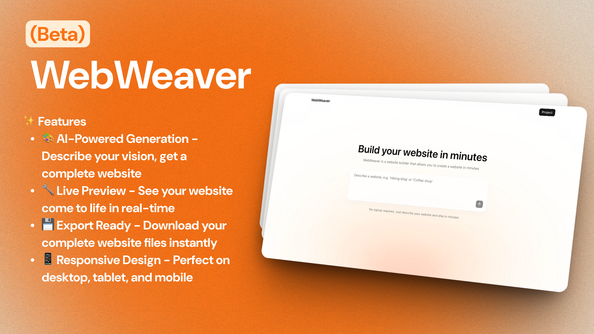

<div align="center">

# 🛠️ WebWeaver - AI Website Builder (Beta)

_Create stunning websites in minutes with the power of AI_



[](https://nextjs.org/)
[](https://fastapi.tiangolo.com/)
[](https://ai.google.dev/)

🚧 **Beta Version** - This is an early release with core features working

_Transform your ideas into beautiful, responsive websites with just a simple description_

</div>

---

## ✨ Current Features

🎨 **AI-Powered Generation** - Describe your website and get HTML/CSS code  
🎯 **Multiple Design Styles** - Choose from modern, classic, minimalist, and bold  
🌈 **Color Schemes** - Select from blue, green, purple, red, orange themes  
📱 **Responsive Output** - Generated websites work on desktop and mobile  
🔧 **Live Code Preview** - See the generated HTML and CSS code  
💾 **Copy & Download** - Get your website files to use anywhere

---

## 🛠️ Tech Stack

**Frontend:** Next.js 15, Tailwind CSS, TypeScript  
**Backend:** FastAPI (Python), Google Gemini AI  
**Server:** Uvicorn

---

## 🚀 Quick Start

### Prerequisites
- **Node.js** 18+ and **pnpm**
- **Python** 3.11+
- **Google Gemini API Key** ([Get it here](https://ai.google.dev/))

### 1️⃣ Clone & Setup

```bash
git clone https://github.com/ItisSubham/WebWeaver
cd WebWeaver
```

### 2️⃣ Backend Setup

```bash
cd backend
python3 -m venv venv
source venv/bin/activate  # Windows: venv\Scripts\activate
pip install -r requirements.txt
```

### 3️⃣ Frontend Setup

```bash
cd ..
pnpm install
```

### 4️⃣ Environment Variables

**Backend (.env):**
```env
GEMINI_API_KEY=your_gemini_api_key_here
ALLOWED_ORIGINS=http://localhost:3000
```

**Frontend (.env.local):**
```env
NEXT_PUBLIC_APP_NAME="WebWeaver"
NEXT_PUBLIC_API_URL=http://localhost:8000
```

### 5️⃣ Start Servers

**Terminal 1 - Backend:**
```bash
cd backend
source venv/bin/activate
uvicorn app:app --reload --host 0.0.0.0 --port 8000
```

**Terminal 2 - Frontend:**
```bash
pnpm dev
```

### 6️⃣ Open Browser
- **App**: http://localhost:3000
- **API Docs**: http://localhost:8000/docs

---

## 📁 Project Structure

```
WebWeaver/
├── backend/
│   ├── app.py              # FastAPI application
│   ├── requirements.txt    # Python dependencies
│   └── venv/              # Virtual environment
├── src/                   # Next.js frontend
├── public/               # Static files
├── package.json          # Frontend dependencies
└── README.md
```

---

## 🎯 How to Use

1. **Start both servers** (backend and frontend)
2. **Open the app** at http://localhost:3000
3. **Describe your website** - e.g., "A portfolio for a photographer"
4. **Choose style and colors**
5. **Click Generate** - Wait for AI to create your website
6. **Copy or download** the generated HTML/CSS files

---

## 🔧 Troubleshooting

**Backend won't start:**
```bash
cd backend
source venv/bin/activate
pip install -r requirements.txt
```

**Frontend issues:**
```bash
rm -rf node_modules
pnpm install
```

**Python compatibility:**
- Use Python 3.11+ (3.13 supported)
- Make sure Gemini API key is set

---

## 📝 Beta Limitations

- ⚠️ Single page generation (multi-page coming soon)
- ⚠️ Basic error handling
- ⚠️ Limited customization options
- ⚠️ No user accounts or saving projects yet

---

## 🤝 Contributing

This is a beta project! We welcome:
- 🐛 Bug reports
- 💡 Feature suggestions  
- 🔧 Code improvements

[Report Issues](../../issues) · [Suggest Features](../../issues)

---

## 📄 License

MIT License - see [LICENSE](LICENSE) file for details.

---

<div align="center">

**🚧 Beta Version - Made with ❤️ and ☕️**

_WebWeaver - Where imagination meets automation_

</div>